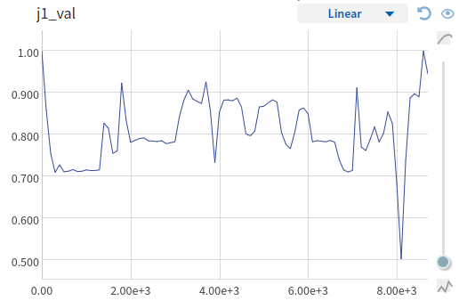

I noted some strange thing during validation:  

Case A: Jaccard score, validation, no soft-labels, no negative examples mining: 

 

Case B: Jaccard score, validation, soft-labels, negative examples mining: 

 

Over all validation Jaccard score is better for Case B, but there is strange peak down - I did not have time to trace it, but it 
is possible results of negative examples mining (false positive)